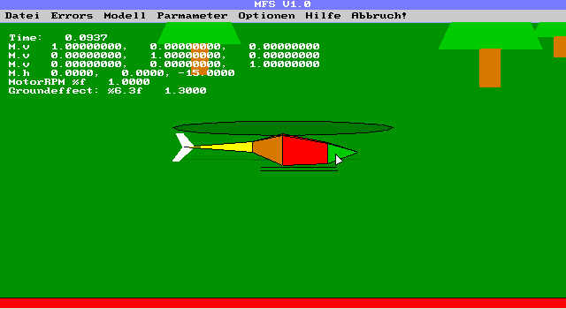

# MFS Modellflugsimulator '96 Edition

MFS96 was my third version of a 3D R/C helicopter simulator for the PC. It was written in 1996 for [MS-DOS](https://en.wikipedia.org/wiki/MS-DOS), supporting an [EGA graphics card](https://en.wikipedia.org/wiki/Enhanced_Graphics_Adapter) with a resolution of 640x350 and 16 colors.

Enhancements to the previous version [MFS94](https://github.com/mariusgreuel/mfs94) include
- 32-bit support via [DOS/4GW](https://en.wikipedia.org/wiki/DOS/4G)
- A GUI with menus and dialogs (though still experimental)
- Joystick support
- Sound
- Performance optimizations using fixed-point math (douh!)

To compile the project, you need [Watcom C/C++](https://en.wikipedia.org/wiki/Watcom_C/C%2B%2B). Precompiled binaries can be found in the bin folder.

Some time later, MFS96 evolved to [MFS98](https://github.com/mariusgreuel/mfs98)

## Screenshot

## System Requirements

- A MS-DOS PC with an EGA graphics card
- A R/C transmitter with the PPM signal connected to a serial ports CTS pin

Today, a virtual machine with Windows 95 will do, although you won't be able to use the R/C transmitter connected to a serial port.

## License

MFS96 is released under the GNU GPLv2.

Copyright (C) 1996 Marius Greuel. All rights reserved.
